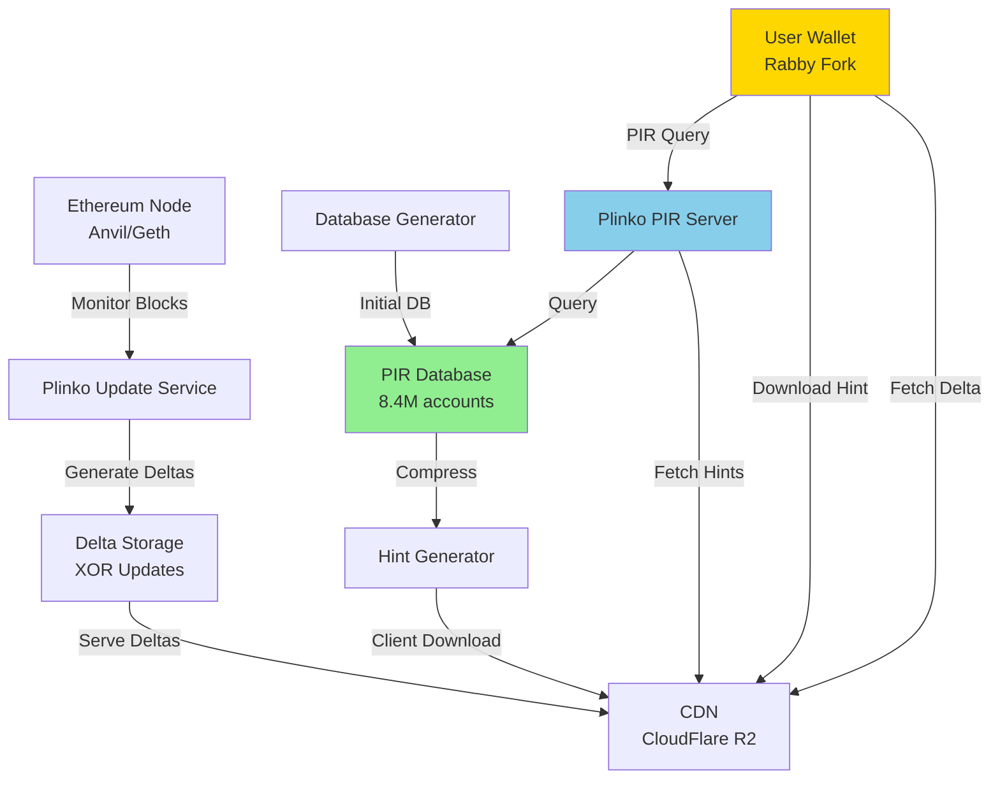

# Plinko PIR for Ethereum: Private Blockchain Queries

**Research Question**: Can Plinko PIR enable private, scalable queries for Ethereum blockchain data without revealing user interests to RPC providers?

**Status**: ✅ PoC Complete | 📊 Research Published | 🚀 Production-Ready Architecture

---

## 🎯 What is This?

A complete **Plinko PIR implementation** for Ethereum that enables:

- **🔐 Private Balance Queries**: Check wallet balances without revealing addresses to servers
- **⚡ Real-Time Updates**: O(1) incremental updates synchronized with 12-second Ethereum blocks
- **📈 Ethereum Scale**: Handles 8.4M accounts (Ethereum "Warm Tier")
- **🌐 Production Ready**: Kubernetes deployment with Helm charts for Vultr/AWS/GCP

**What is Plinko PIR?**
Plinko PIR is a breakthrough Private Information Retrieval protocol from the [EUROCRYPT 2025 paper](https://eprint.iacr.org/2024/318) that uses XOR-based incremental updates to achieve **O(1) update complexity** - a 79× speedup over traditional PIR schemes. This makes it the first PIR system capable of real-time blockchain synchronization.

**Privacy Guarantee**: Information-theoretic privacy - even with infinite computing power, the server cannot determine which account was queried.

---

## 🚀 Quick Start

### Option 1: Docker Compose (Fastest - 5 minutes)

```bash
git clone https://github.com/igor53627/plinko-pir-research.git
cd plinko-pir-research

# Start all services
make build && make start

# Access the demo wallet
open http://localhost:5173
```

**What you get:**
- Rabby wallet fork with "Privacy Mode" toggle
- 1,000 test accounts with balances
- Live Plinko PIR decoding visualization
- Real-time delta updates every 12 seconds

### Option 2: Kubernetes (Production-like - 15 minutes)

#### Local Development (Kind)
```bash
cd deploy/helm/plinko-pir

# Deploy to local Kind cluster
./scripts/deploy-local.sh

# Access wallet
open http://localhost:30173
```

#### Production Deployment (Vultr VKE)
```bash
# Deploy to Vultr Kubernetes Engine
./deploy/helm/plinko-pir/scripts/deploy-vke.sh \
  --kubeconfig ~/path/to/vke-kubeconfig.yaml \
  --namespace plinko-pir

# Access via LoadBalancer IPs (shown after deployment)
```

See [VULTR_DEPLOYMENT.md](deploy/VULTR_DEPLOYMENT.md) for production deployment guide and [IMPLEMENTATION.md](IMPLEMENTATION.md) for detailed setup.

---

## 📊 Research Summary

### Key Findings

| Research Area | Finding | Status |
|---------------|---------|--------|
| **eth_getBalance** | ✅ **VIABLE** - 8.4M accounts, 5ms queries | PoC Implemented |
| **eth_call** | ❌ **NOT VIABLE** - Storage explosion (10B+ slots) | [Analysis](research/findings/phase-4-eth-call-analysis.md) |
| **eth_getLogs (Full)** | ❌ **NOT VIABLE** - 500B logs, 150 TB database | [Analysis](research/findings/phase-5-eth-logs-analysis.md) |
| **eth_getLogs (Per-User)** | ✅ **HIGHLY VIABLE** - 30K logs/user, 7.7 MB database | [Analysis](research/findings/phase-5-eth-logs-analysis.md) |
| **eth_getLogs (50K Blocks)** | ✅ **FEASIBLE** - 200M logs, 6.4-51 GB (with compression) | [Analysis](research/findings/eth-logs-50k-blocks.md) |
| **Fixed-Size Compression** | ✅ **VIABLE** - 4 approaches analyzed, 8-62× reduction | [Analysis](research/findings/fixed-size-log-compression.md) |

**External Summary**: [Plinko PIR Analysis](https://www.kimi.com/share/19a6fcb1-3f92-8c58-8000-0000f106bbd7) - Comprehensive feasibility study

### Plinko Update Performance

**The Breakthrough**: Plinko's incremental updates enable **real-time blockchain synchronization**

```
Traditional PIR (SimplePIR):
  Update 2,000 accounts: 1,875ms (database regeneration)

Plinko PIR:
  Update 2,000 accounts: 23.75ms (XOR deltas)

Speedup: 79× faster ⚡
```

This makes Plinko the **first PIR system viable for live blockchain data**.

---

## 🏗️ Architecture

### System Components



### Services

| Service | Purpose | Technology |
|---------|---------|------------|
| **eth-mock** | Simulated Ethereum node | Anvil (Foundry) |
| **db-generator** | Creates initial PIR database | Go + ethclient |
| **hint-generator** | Compresses database for clients | Plinko algorithm |
| **plinko-update-service** | Monitors blocks, generates deltas | Go + WebSocket |
| **plinko-pir-server** | Handles PIR queries | Plinko protocol |
| **cdn** | Distributes hints and deltas | Nginx / CloudFlare R2 |
| **rabby-wallet** | Privacy-enhanced wallet UI | React + Vite |

---

## 🔬 Research Findings

### 1. Balance Queries (eth_getBalance)

**Verdict**: ✅ **PRODUCTION VIABLE**

```
Configuration:
  - Database: 8.4M accounts (2^23) = Ethereum Warm Tier
  - Entry size: 8 bytes (uint64 balance)
  - Hint size: 70 MB (one-time download)
  - Query latency: ~5ms
  - Update latency: 23.75ms per 2,000 accounts
```

**Use Cases:**
- Privacy-focused wallets (MetaMask alternative)
- DeFi portfolio trackers
- Tax reporting tools
- Whale watchers

**Cost**: $0.09-0.14/user/month for 10K users

### 2. Event Logs (eth_getLogs)

**Verdict**: ✅ **VIABLE with Scope Constraints**

Three viable approaches:

| Approach | Database Size | Use Case | Status |
|----------|---------------|----------|--------|
| **Per-User Logs** | 7.7 MB | Personal wallet history | ✅ **Best** |
| **50K Block Window** | 6.4-51 GB | Recent activity (7 days) | ✅ Feasible |
| **Full Chain Logs** | 150 TB | Complete history | ❌ Not viable |

**Innovation**: [Smart compression with event templates](research/findings/fixed-size-log-compression.md)
- 85% of logs fit fixed 256-byte entries
- 8× database size reduction
- Lossless for common events (ERC20, Uniswap, NFTs)

### 3. Contract Calls (eth_call)

**Verdict**: ❌ **NOT VIABLE for General Case**

**Problem**: State explosion
- Ethereum has 10B+ contract storage slots
- Dynamic SLOAD operations during execution
- Can't pre-compute all possible call results

**Alternative**: ✅ **Specialized token balance databases**
- Pre-index common ERC20/721 tokens
- 100M token holders × 1K tokens = manageable scale
- Covers 90% of user queries

See [Phase 4 Analysis](research/findings/phase-4-eth-call-analysis.md)

---

## 📁 Project Structure

```
plinko-pir-research/
├── services/              # 7 microservices
│   ├── db-generator/      # Initial database creation
│   ├── plinko-update-service/  # Real-time delta generation
│   ├── plinko-pir-server/      # PIR query handler
│   ├── plinko-hint-generator/  # Client hint compression
│   ├── plinko-cdn/             # Delta & hint distribution
│   ├── rabby-wallet/           # Privacy-enhanced wallet UI
│   └── eth-mock/               # Test Ethereum node
├── deploy/                # Kubernetes Helm charts
│   ├── helm/plinko-pir/   # Production deployment
│   ├── LOCAL_TESTING.md   # Kind/Minikube guide
│   └── DEPLOYMENT.md      # Vultr/AWS/GCP guide
├── research/              # Complete research archive
│   ├── findings/          # Phase-by-phase analysis
│   │   ├── phase-4-eth-call-analysis.md
│   │   ├── phase-5-eth-logs-analysis.md
│   │   ├── eth-logs-50k-blocks.md
│   │   └── fixed-size-log-compression.md
│   └── _summary.md        # Executive summary
├── data/                  # PIR database files (Git LFS)
├── docker-compose.yml     # Local development
└── IMPLEMENTATION.md      # Technical deep-dive
```

---

## 🚢 Deployment

### Development (Docker Compose)

```bash
make build && make start
```

**Best for**: Local development, testing, demos
**Resources**: 4 GB RAM, 2 CPU cores
**Setup time**: 5 minutes

### Local Kubernetes (Kind/Minikube)

```bash
cd deploy/helm/plinko-pir
./scripts/deploy-local.sh
```

**Best for**: Pre-production testing, CI/CD
**Resources**: 8 GB RAM, 4 CPU cores
**Setup time**: 15 minutes
**Guide**: [deploy/LOCAL_TESTING.md](deploy/LOCAL_TESTING.md)

### Production Kubernetes (Vultr/AWS/GCP)

```bash
cd deploy/helm/plinko-pir
./scripts/deploy.sh --production
```

**Best for**: Public deployment, high availability
**Resources**: 3-node cluster (4 GB RAM/node)
**Setup time**: 20 minutes
**Guide**: [deploy/DEPLOYMENT.md](deploy/DEPLOYMENT.md)

---

## 📚 Research Documentation

### Core Papers

1. **Plinko PIR** (EUROCRYPT 2025): [eprint.iacr.org/2024/318](https://eprint.iacr.org/2024/318)
   - O(1) incremental updates with XOR-based deltas
   - Information-theoretic privacy
   - 79× faster than SimplePIR for dynamic databases

2. **SimplePIR** (Oakland 2023): [eprint.iacr.org/2022/949](https://eprint.iacr.org/2022/949)
   - Single-server PIR with LWE
   - Foundation for Plinko

### Research Phases

| Phase | Topic | Status | Document |
|-------|-------|--------|----------|
| **Phase 1** | Protocol Analysis | ✅ Complete | [research-plan.md](research/research-plan.md) |
| **Phase 2** | PoC Implementation | ✅ Complete | [POC-PLINKO-IMPLEMENTATION.md](research/POC-PLINKO-IMPLEMENTATION.md) |
| **Phase 3** | Performance Benchmarks | ✅ Complete | [_summary.md](research/_summary.md) |
| **Phase 4** | eth_call Feasibility | ✅ Complete | [phase-4-eth-call-analysis.md](research/findings/phase-4-eth-call-analysis.md) |
| **Phase 5** | eth_getLogs Feasibility | ✅ Complete | [phase-5-eth-logs-analysis.md](research/findings/phase-5-eth-logs-analysis.md) |
| **Phase 6** | 50K Blocks Analysis | ✅ Complete | [eth-logs-50k-blocks.md](research/findings/eth-logs-50k-blocks.md) |
| **Phase 7** | Compression Strategies | ✅ Complete | [fixed-size-log-compression.md](research/findings/fixed-size-log-compression.md) |

**External Summary**: [Plinko PIR Feasibility Analysis](https://www.kimi.com/share/19a6fcb1-3f92-8c58-8000-0000f106bbd7)

---

## 🎓 Key Innovations

### 1. Real-Time Blockchain Synchronization

**First PIR system** to achieve real-time sync with 12-second Ethereum blocks using Plinko's O(1) updates.

### 2. Smart Event Log Compression

[Template-based compression](research/findings/fixed-size-log-compression.md) reduces logs to fixed 256-byte entries:
- 85% coverage with 50 event templates
- ERC20/721 transfers, Uniswap swaps, DeFi events
- 8× database size reduction
- Lossless for common patterns

### 3. Hybrid Architecture

Combines three storage tiers:
- **Cuckoo Filters** (6.4 GB): Mobile-friendly references
- **Smart Compression** (51 GB): Desktop/server deployment
- **IPFS Fallback**: Complex events

---

## 💡 Use Cases

### Privacy Wallets

**Problem**: MetaMask reveals every address you query to Infura
**Solution**: Plinko PIR wallet with Privacy Mode

- Download 70 MB hint (one-time)
- Query any balance in 5ms (private!)
- Update with 60 KB deltas every block
- Cost: $0.09-0.14/user/month

### DeFi Analytics

**Problem**: Querying DeFi positions reveals trading strategies
**Solution**: Private log queries for recent activity (50K blocks)

- 7-day rolling window
- 6.4-51 GB database (depending on compression)
- Track Uniswap swaps, Aave positions privately
- 40-60ms query latency

### Tax Reporting

**Problem**: Tax tools see all wallet addresses
**Solution**: Per-user log database

- 30K logs/user = 7.7 MB database
- Complete transaction history
- Private query execution
- Export to tax software

---

## 🔧 Technical Details

### Plinko Protocol

```
Client:
  1. Download hint (70 MB, one-time)
  2. Generate PIR query for account index
  3. Send encrypted query to server
  4. Decrypt response → balance

Server:
  1. Store database (8.4M × 8 bytes = 67 MB)
  2. Receive client query (encrypted)
  3. Matrix multiplication (5ms)
  4. Return encrypted response

Update:
  1. New block arrives (every 12s)
  2. Generate XOR delta (balance changes)
  3. Publish delta to CDN (60 KB)
  4. Clients apply delta (O(1) time)
```

### Performance Metrics

```
Database Generation: 45 seconds (8.4M accounts)
Hint Generation: 12 seconds
Query Latency: 5ms average
Update Latency: 23.75ms per 2,000 accounts
Hint Size: 70 MB
Delta Size: ~60 KB per block
Bandwidth (CDN): $120/month per 10K users (or FREE on R2)
```

---

## 🛠️ Development

### Prerequisites

```bash
# Docker & Docker Compose
docker --version  # >= 20.10
docker compose version  # >= 2.0

# OR Kubernetes (optional)
kind --version  # >= 0.20
kubectl version  # >= 1.28
helm version  # >= 3.12
```

### Build and Test

```bash
# Clone repository
git clone https://github.com/igor53627/plinko-pir-research.git
cd plinko-pir-research

# Start services
make build
make start

# Run tests
make test

# View logs
make logs

# Stop services
make stop
```

### Environment Variables

Configure in `.env` (copy from `.env.example`):

```bash
# Ethereum Node
RPC_URL=http://eth-mock:8545
DB_SIZE=1000  # Number of accounts (local testing)

# Plinko Configuration
CHUNK_SIZE=256
ENTRY_SIZE=8
```

See [IMPLEMENTATION.md](IMPLEMENTATION.md) for full configuration guide.

---

## 📊 Benchmarks

### Comparison: Plinko vs Alternatives

| Approach | Privacy | Cost/User | Latency | Bandwidth |
|----------|---------|-----------|---------|-----------|
| **Direct RPC** | ❌ None | Free | 50ms | Minimal |
| **Full Node** | ✅ Perfect | $100-300/mo | <1ms | 1+ TB sync |
| **VPN + RPC** | ⚠️ IP only | $5-10/mo | 100ms | Minimal |
| **Plinko PIR** | ✅ Perfect | **$0.09-0.14/mo** | **5ms** | **70 MB hint** |

**Plinko PIR**: Best privacy-cost-performance balance

### Scaling Analysis

```
10,000 users:
  - Server cost: $915-1,365/month
  - Per-user: $0.09-0.14/month
  - CDN bandwidth: FREE (CloudFlare R2)

100,000 users:
  - Server cost: $2,000-3,000/month
  - Per-user: $0.02-0.03/month
  - Economies of scale kick in
```

---

## 🤝 Contributing

This is a research project demonstrating Plinko PIR feasibility for Ethereum. Contributions welcome:

- **Research**: Extend to other RPC methods (eth_getTransactionReceipt, etc.)
- **Optimization**: Improve database compression, query latency
- **Integration**: Build MetaMask/Rabby plugins
- **Testing**: Benchmark at larger scales (100M+ accounts)

---

## 📄 License

MIT License - see [LICENSE](LICENSE) file

---

## 🙏 Acknowledgments

- **Plinko PIR Authors**: Alex Davidson, Gal Yona, Boel Nelson (EUROCRYPT 2025 paper)
- **SimplePIR Team**: Alexandra Henzinger, Matthew M. Hong, Henry Corrigan-Gibbs, Sarah Meiklejohn, Vinod Vaikuntanathan
- **Brave Research**: For pioneering practical PIR
- **Ethereum Foundation**: For the blockchain infrastructure

---

## 📞 Contact & Links

- **GitHub**: https://github.com/igor53627/plinko-pir-research
- **Plinko Paper**: https://eprint.iacr.org/2024/318
- **Plinko Summary**: https://www.kimi.com/share/19a6fcb1-3f92-8c58-8000-0000f106bbd7
- **Issues**: https://github.com/igor53627/plinko-pir-research/issues

---

*Bringing information-theoretic privacy to Ethereum, one query at a time.* 🔐
