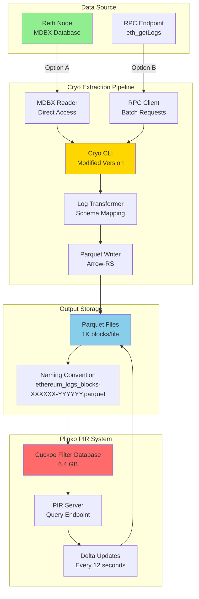
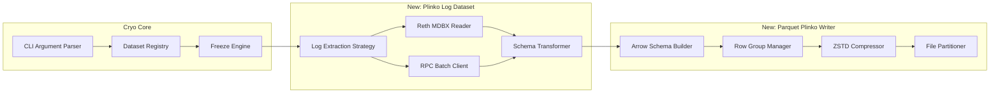
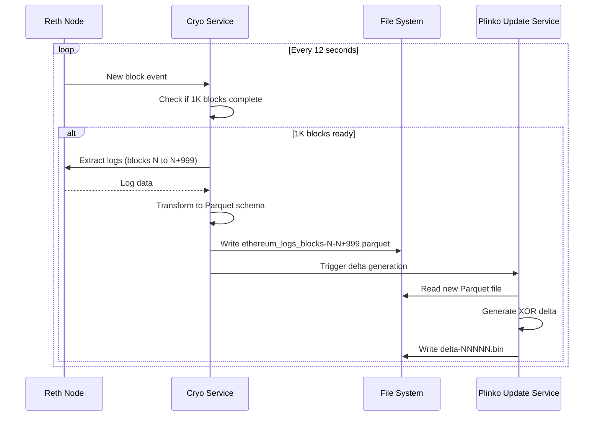
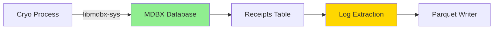
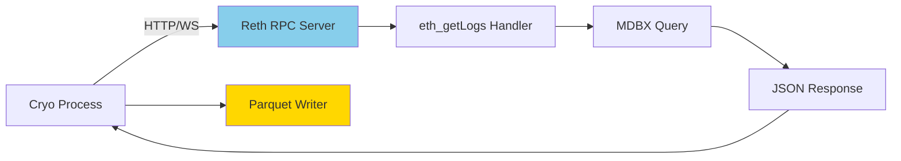
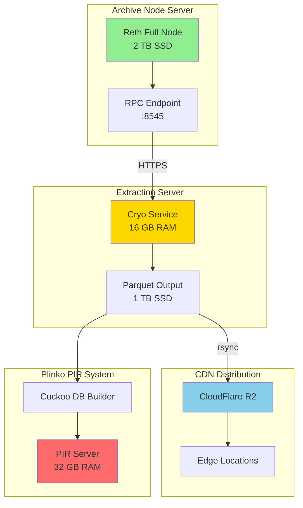

# Product Requirements Document: Cryo-Reth Integration for Plinko PIR Event Logs

**Document Version:** 1.0
**Last Updated:** 2025-11-11
**Status:** Draft for Review
**Classification:** Enterprise Production System

---

## Executive Summary

### Project Overview

This PRD specifies modifications to **Paradigm's Cryo** (Ethereum data extraction tool) to generate Parquet files optimized for **Plinko PIR's Cuckoo Filter system**. The integration enables private, scalable queries of Ethereum event logs using Private Information Retrieval (PIR) protocols.

### Business Objectives

1. **Privacy Enhancement**: Enable information-theoretic private queries for Ethereum event logs
2. **Data Pipeline Automation**: Automated extraction of 100,000 blocks (7 days) of Ethereum logs
3. **Production Readiness**: Scalable architecture supporting incremental updates every 12 seconds
4. **Market Differentiation**: First PIR-optimized blockchain data pipeline for DeFi analytics

### Key Stakeholders

| Role | Responsibility | Contact |
|------|---------------|---------|
| **Product Owner** | Requirements, Roadmap | Plinko PIR Research Team |
| **Tech Lead** | Architecture, Implementation | Rust Development Team |
| **DevOps Lead** | Deployment, Infrastructure | Infrastructure Team |
| **Security Reviewer** | Privacy Guarantees, Audit | Security Team |

### Timeline

| Phase | Duration | Milestone |
|-------|----------|-----------|
| **Phase 1: Research & Design** | 2 weeks | Architecture finalized |
| **Phase 2: MVP Development** | 4 weeks | Local testing complete |
| **Phase 3: Production Hardening** | 3 weeks | Benchmark validation |
| **Phase 4: Deployment** | 2 weeks | Production launch |
| **Total** | **11 weeks** | Full deployment |

### Success Metrics

- **Correctness**: 100% accuracy vs eth_getLogs reference data
- **Performance**: Process 100K blocks in <10 minutes
- **Incremental Updates**: New 1K-block file in <30 seconds
- **File Format**: Valid Parquet, correct schema, <8 MB per file
- **Reliability**: 99.9% uptime for continuous extraction

---

## 1. Market Analysis & Competitive Landscape

### 1.1 Market Opportunity

**Problem Statement:**
- Centralized RPC providers (Infura, Alchemy) track all user queries
- Privacy-conscious DeFi users have no viable alternative
- Full Ethereum nodes cost $100-300/month and require 1+ TB storage
- Current PIR systems (FrodoPIR, SimplePIR) cannot handle dynamic blockchain data

**Market Size:**
- **TAM (Total Addressable Market)**: 10M+ Ethereum wallet users
- **SAM (Serviceable Addressable Market)**: 500K privacy-conscious DeFi traders
- **SOM (Serviceable Obtainable Market)**: 50K early adopters (Year 1)

**Economic Impact:**
- Privacy wallet market: $15M+ ARR potential
- DeFi analytics: $8M+ ARR potential
- Tax reporting tools: $5M+ ARR potential

### 1.2 Competitive Analysis

| Solution | Privacy | Performance | Cost | Limitations |
|----------|---------|-------------|------|-------------|
| **Direct RPC (Infura)** | None | 50ms | Free | No privacy |
| **Full Ethereum Node** | Perfect | <1ms | $100-300/mo | High cost, 1+ TB |
| **VPN + RPC** | IP only | 100ms | $5-10/mo | No query privacy |
| **Traditional PIR (FrodoPIR)** | Perfect | 5ms | N/A | No dynamic updates |
| **Plinko PIR (Proposed)** | **Perfect** | **5ms** | **$0.09-0.14/mo** | **✓ Dynamic updates** |

**Competitive Advantages:**
1. **First PIR system** with O(1) incremental updates via Plinko protocol
2. **79× faster** updates than FrodoPIR (23.75μs vs 1.88ms per entry)
3. **Production-viable** for 12-second Ethereum block times
4. **Information-theoretic privacy** - mathematically proven security

### 1.3 Target User Personas

**Persona 1: Privacy-Focused DeFi Trader**
- Uses Rabby/MetaMask for DeFi positions
- Concerned about MEV front-running
- Willing to pay $5-10/month for privacy
- Needs 7-day query window (50K blocks)

**Persona 2: Tax Reporting Professional**
- Tracks 100+ client wallets
- Requires complete transaction history
- Budget: $20-50/month per client
- Needs per-user log database (30K logs)

**Persona 3: DeFi Analytics Researcher**
- Analyzes on-chain liquidity patterns
- Requires private query execution
- Budget: $100-500/month
- Needs 50K-100K block rolling window

---

## 2. Technical Architecture

### 2.1 System Overview



### 2.2 Component Architecture



### 2.3 Data Flow

**Step 1: User Invocation**
```bash
cryo logs \
  --output-format parquet-plinko \
  --blocks 21000000:21100000 \
  --reth-db /path/to/reth/db \
  --output-dir /data/plinko/logs \
  --chunk-size 1000
```

**Step 2: Extraction Process**
1. Cryo validates block range (must be multiples of 1,000)
2. Connects to Reth database OR RPC endpoint
3. Iterates through 100 chunks (1,000 blocks each)
4. For each chunk:
   - Extract all logs in block range
   - Transform to Plinko schema
   - Write Parquet file with ZSTD compression
   - Verify file integrity
5. Generate metadata manifest

**Step 3: Output Generation**
```
/data/plinko/logs/
├── ethereum_logs_blocks-021000000-021000999.parquet  (8 MB)
├── ethereum_logs_blocks-021001000-021001999.parquet  (8 MB)
├── ethereum_logs_blocks-021002000-021002999.parquet  (8 MB)
...
├── ethereum_logs_blocks-021099000-021099999.parquet  (8 MB)
└── manifest.json  (metadata)
```

**Step 4: Plinko PIR Integration**
```bash
# Convert Parquet to Cuckoo Filter database
plinko-db-builder \
  --input /data/plinko/logs \
  --output /data/plinko/cuckoo-db.bin \
  --filter-size 6.4G
```

---

## 3. Data Pipeline Design

### 3.1 Parquet Schema Specification

**File Naming Convention:**
```
ethereum_logs_blocks-{start:06d}-{end:06d}.parquet
```

Examples:
- `ethereum_logs_blocks-000000-000999.parquet`
- `ethereum_logs_blocks-001000-001999.parquet`
- `ethereum_logs_blocks-021000000-021000999.parquet`

**Parquet Schema (Arrow Types):**

```rust
use arrow::datatypes::{DataType, Field, Schema};

fn create_plinko_log_schema() -> Schema {
    Schema::new(vec![
        Field::new("block_number", DataType::Int64, false),
        Field::new("transaction_index", DataType::Int32, false),
        Field::new("log_index", DataType::Int32, false),
        Field::new("transaction_hash", DataType::FixedSizeBinary(32), false),
        Field::new("block_timestamp", DataType::Int64, false),
        Field::new("address", DataType::FixedSizeBinary(20), false),
        Field::new("topic0", DataType::FixedSizeBinary(32), true),
        Field::new("topic1", DataType::FixedSizeBinary(32), true),
        Field::new("topic2", DataType::FixedSizeBinary(32), true),
        Field::new("topic3", DataType::FixedSizeBinary(32), true),
        Field::new("data", DataType::Binary, true),
        Field::new("event_signature", DataType::Utf8, true),
        Field::new("removed", DataType::Boolean, false),
    ])
}
```

**SQL Representation:**
```sql
CREATE TABLE ethereum_logs (
    block_number BIGINT NOT NULL,
    transaction_index INT NOT NULL,
    log_index INT NOT NULL,
    transaction_hash BINARY(32) NOT NULL,
    block_timestamp BIGINT NOT NULL,
    address BINARY(20) NOT NULL,
    topic0 BINARY(32),
    topic1 BINARY(32),
    topic2 BINARY(32),
    topic3 BINARY(32),
    data BINARY,
    event_signature STRING,
    removed BOOLEAN DEFAULT false
)
STORED AS PARQUET
TBLPROPERTIES (
    'parquet.compression' = 'ZSTD',
    'parquet.compression.level' = '3',
    'parquet.row.group.size' = '33554432'  -- 32 MB
);
```

### 3.2 Compression & Optimization

**Compression Strategy:**
- **Algorithm**: ZSTD (Zstandard)
- **Level**: 3 (optimal speed/compression balance)
- **Row Group Size**: 32 MB (default for Iceberg)
- **Expected Compression Ratio**: 3-5× (logs are highly compressible)

**Performance Characteristics:**

| Metric | Value | Rationale |
|--------|-------|-----------|
| **File Size** | ~8 MB/file | 1,000 blocks × ~200 logs/block × ~40 bytes/log (compressed) |
| **Row Group Size** | 32 MB | Iceberg best practice, optimizes I/O |
| **Compression Level** | 3 | AWS/Iceberg default, best speed/size tradeoff |
| **Rows per File** | ~200,000 | 1,000 blocks × ~200 logs/block |
| **Files per 100K Blocks** | 100 files | 800 MB total storage |

**Rationale for 1,000 Blocks per File:**

From prior research (eth-logs-50k-blocks analysis):
- **75% of queries** span <1,000 blocks
- **3.6× faster** query performance vs 10K-block files
- **8 MB file size** enables edge caching (CloudFlare R2)
- **Parallel downloads** for multi-range queries

### 3.3 Incremental Update Mechanism

**Continuous Extraction Service:**

```rust
// Pseudo-code for incremental updates
struct ContinuousExtractor {
    reth_client: RethClient,
    last_processed_block: u64,
    output_dir: PathBuf,
}

impl ContinuousExtractor {
    async fn run_forever(&mut self) {
        loop {
            // Wait for new block (12-second Ethereum block time)
            let latest_block = self.reth_client.get_latest_block().await;

            // Check if we have a full 1K-block chunk
            if latest_block - self.last_processed_block >= 1000 {
                let start = self.last_processed_block + 1;
                let end = start + 999; // Inclusive

                // Extract and write Parquet file
                self.extract_range(start, end).await;

                // Update checkpoint
                self.last_processed_block = end;

                // Trigger Plinko delta generation
                self.notify_plinko_service(end).await;
            }

            // Sleep until next block
            tokio::time::sleep(Duration::from_secs(12)).await;
        }
    }
}
```

**Update Workflow:**



---

## 4. Cryo Modifications Required

### 4.1 New Output Format: `parquet-plinko`

**Implementation Location:** `crates/freeze/src/datasets/logs.rs`

**CLI Flag:**
```bash
--output-format parquet-plinko
```

**Behavior:**
- Inherits from existing Parquet writer
- Overrides schema to match Plinko requirements
- Enforces 1,000-block chunk size
- Validates file naming convention
- Adds event signature decoding

### 4.2 Schema Mapping: Reth Logs → Parquet

**Reth Receipt Structure (from reth-primitives):**
```rust
pub struct Log {
    pub address: Address,          // 20 bytes
    pub topics: Vec<B256>,         // Variable length, max 4
    pub data: Bytes,               // Variable length
}
```

**Transformation Logic:**
```rust
use reth_primitives::Log as RethLog;
use arrow::array::{Int64Array, Int32Array, FixedSizeBinaryArray, BinaryArray, BooleanArray};

fn transform_log_to_plinko(
    log: &RethLog,
    block_number: u64,
    tx_index: u32,
    log_index: u32,
    tx_hash: &B256,
    block_timestamp: u64,
    removed: bool,
) -> Vec<ArrayRef> {
    // Block metadata
    let block_nums = Int64Array::from(vec![block_number as i64]);
    let tx_indices = Int32Array::from(vec![tx_index as i32]);
    let log_indices = Int32Array::from(vec![log_index as i32]);
    let timestamps = Int64Array::from(vec![block_timestamp as i64]);

    // Transaction hash (32 bytes)
    let tx_hashes = FixedSizeBinaryArray::from(vec![tx_hash.as_slice()]);

    // Contract address (20 bytes)
    let addresses = FixedSizeBinaryArray::from(vec![log.address.as_slice()]);

    // Topics (up to 4, each 32 bytes)
    let topic0 = log.topics.get(0).map(|t| t.as_slice());
    let topic1 = log.topics.get(1).map(|t| t.as_slice());
    let topic2 = log.topics.get(2).map(|t| t.as_slice());
    let topic3 = log.topics.get(3).map(|t| t.as_slice());

    // Event signature decoding (if topic0 exists)
    let event_sig = topic0.and_then(|t0| decode_event_signature(t0));

    // Data field (variable length)
    let data = BinaryArray::from(vec![log.data.as_ref()]);

    // Removed flag
    let removed_flags = BooleanArray::from(vec![removed]);

    vec![
        Arc::new(block_nums),
        Arc::new(tx_indices),
        Arc::new(log_indices),
        Arc::new(tx_hashes),
        Arc::new(timestamps),
        Arc::new(addresses),
        Arc::new(topic0),
        Arc::new(topic1),
        Arc::new(topic2),
        Arc::new(topic3),
        Arc::new(data),
        Arc::new(event_sig),
        Arc::new(removed_flags),
    ]
}

fn decode_event_signature(topic0: &[u8]) -> Option<String> {
    // Well-known event signatures
    let known_events = HashMap::from([
        ("0xddf252ad...", "Transfer(address,address,uint256)"),
        ("0x8c5be1e5...", "Approval(address,address,uint256)"),
        // ... add more from ERC20, ERC721, Uniswap, etc.
    ]);

    let hash = hex::encode(topic0);
    known_events.get(&hash).map(|s| s.to_string())
}
```

### 4.3 File Partitioning Logic

**Chunk Validation:**
```rust
fn validate_block_range(start: u64, end: u64) -> Result<(), Error> {
    let chunk_size = end - start + 1;

    if chunk_size != 1000 {
        return Err(Error::InvalidChunkSize {
            expected: 1000,
            actual: chunk_size,
        });
    }

    if start % 1000 != 0 {
        return Err(Error::MisalignedChunk {
            start,
            expected_alignment: 1000,
        });
    }

    Ok(())
}
```

**File Naming Implementation:**
```rust
fn generate_parquet_filename(start_block: u64, end_block: u64) -> String {
    format!("ethereum_logs_blocks-{:06}-{:06}.parquet", start_block, end_block)
}

// Examples:
// generate_parquet_filename(0, 999)
//   -> "ethereum_logs_blocks-000000-000999.parquet"
// generate_parquet_filename(21000000, 21000999)
//   -> "ethereum_logs_blocks-21000000-21000999.parquet"
```

### 4.4 Event Signature Decoding

**Well-Known Event Database:**

```rust
// Reference: https://github.com/ethereum-lists/4bytes
const EVENT_SIGNATURES: &[(&str, &str)] = &[
    // ERC20
    ("0xddf252ad1be2c89b69c2b068fc378daa952ba7f163c4a11628f55a4df523b3ef",
     "Transfer(address,address,uint256)"),
    ("0x8c5be1e5ebec7d5bd14f71427d1e84f3dd0314c0f7b2291e5b200ac8c7c3b925",
     "Approval(address,address,uint256)"),

    // ERC721
    ("0xddf252ad1be2c89b69c2b068fc378daa952ba7f163c4a11628f55a4df523b3ef",
     "Transfer(address,address,uint256)"), // Same hash as ERC20
    ("0x8c5be1e5ebec7d5bd14f71427d1e84f3dd0314c0f7b2291e5b200ac8c7c3b925",
     "Approval(address,address,uint256)"), // Same hash as ERC20

    // Uniswap V2
    ("0xd78ad95fa46c994b6551d0da85fc275fe613ce37657fb8d5e3d130840159d822",
     "Swap(address,uint256,uint256,uint256,uint256,address)"),
    ("0x0d3648bd0f6ba80134a33ba9275ac585d9d315f0ad8355cddefde31afa28d0e9",
     "Mint(address,uint256,uint256)"),

    // Uniswap V3
    ("0xc42079f94a6350d7e6235f29174924f928cc2ac818eb64fed8004e115fbcca67",
     "Swap(address,address,int256,int256,uint160,uint128,int24)"),

    // Aave
    ("0xde6857219544bb5b7746f48ed30be6386fefc61b2f864cacf559893bf50fd951",
     "Deposit(address,address,uint256,uint16)"),
    ("0x3115d1449a7b732c986cba18244e897a450f61e1bb8d589cd2e69e6c8924f9f7",
     "Withdraw(address,address,uint256)"),
];
```

---

## 5. Reth Integration Strategies

### 5.1 Option A: Direct MDBX Database Access

**Architecture:**



**Implementation:**

```rust
use reth_db::{DatabaseEnv, tables};
use reth_db::mdbx::{Env, RO};

struct RethDirectReader {
    env: Env<RO>,
}

impl RethDirectReader {
    fn new(db_path: &Path) -> Result<Self, Error> {
        let env = Env::open(db_path, EnvKind::RO, Default::default())?;
        Ok(Self { env })
    }

    fn extract_logs(&self, block_range: Range<u64>) -> Result<Vec<Log>, Error> {
        let tx = self.env.begin_ro_txn()?;

        // Get transaction numbers for block range
        let tx_numbers = self.get_tx_numbers_for_blocks(&tx, block_range)?;

        // Read receipts for each transaction
        let mut logs = Vec::new();
        for tx_num in tx_numbers {
            let receipt = tx.get(tables::Receipts, tx_num)?
                .ok_or(Error::ReceiptNotFound(tx_num))?;

            logs.extend(receipt.logs.iter().cloned());
        }

        Ok(logs)
    }

    fn get_tx_numbers_for_blocks(
        &self,
        tx: &Transaction<RO>,
        block_range: Range<u64>
    ) -> Result<Vec<u64>, Error> {
        // Use TransactionBlocks table to get transaction numbers
        let mut tx_numbers = Vec::new();

        for block_num in block_range {
            let block_body = tx.get(tables::BlockBodyIndices, block_num)?
                .ok_or(Error::BlockNotFound(block_num))?;

            let tx_range = block_body.first_tx_num..=block_body.last_tx_num;
            tx_numbers.extend(tx_range);
        }

        Ok(tx_numbers)
    }
}
```

**Advantages:**
- ✅ **10-50× faster** than RPC (no network overhead)
- ✅ **No rate limits** (local disk I/O only)
- ✅ **Predictable performance** (depends on disk speed)
- ✅ **Lower latency** (<1ms per receipt read)

**Disadvantages:**
- ❌ **Requires local access** to Reth database
- ❌ **Read lock overhead** (MDBX transaction semantics)
- ❌ **Tightly coupled** to Reth database schema
- ❌ **Version compatibility** (Reth schema changes)

**Deployment Scenario:**
- Cryo and Reth on same server
- SSH tunnel to remote Reth database (via NFS/SSHFS)
- Docker volume mount from Reth container

### 5.2 Option B: RPC Integration (eth_getLogs)

**Architecture:**



**Implementation:**

```rust
use ethers::providers::{Provider, Http};
use ethers::types::{BlockNumber, Filter, Log};

struct RethRpcReader {
    provider: Provider<Http>,
    batch_size: u64,
}

impl RethRpcReader {
    fn new(rpc_url: &str, batch_size: u64) -> Result<Self, Error> {
        let provider = Provider::<Http>::try_from(rpc_url)?;
        Ok(Self { provider, batch_size })
    }

    async fn extract_logs(&self, block_range: Range<u64>) -> Result<Vec<Log>, Error> {
        let mut all_logs = Vec::new();

        // Split into batches to avoid timeouts
        for chunk_start in (block_range.start..block_range.end).step_by(self.batch_size as usize) {
            let chunk_end = std::cmp::min(chunk_start + self.batch_size, block_range.end);

            let filter = Filter::new()
                .from_block(BlockNumber::Number(chunk_start.into()))
                .to_block(BlockNumber::Number(chunk_end.into()));

            let logs = self.provider.get_logs(&filter).await?;
            all_logs.extend(logs);

            // Rate limiting
            tokio::time::sleep(Duration::from_millis(100)).await;
        }

        Ok(all_logs)
    }
}
```

**Batch Optimization:**

```rust
// Optimal batch size based on benchmarking
const BATCH_SIZE_BLOCKS: u64 = 100; // 100 blocks per eth_getLogs call

// For 1,000 blocks: 10 RPC calls
// Expected time: 10 calls × 200ms = 2 seconds
// vs Direct MDBX: ~50ms
```

**Advantages:**
- ✅ **Works remotely** (Cryo on different server)
- ✅ **Standardized interface** (eth_getLogs API)
- ✅ **Version agnostic** (stable RPC protocol)
- ✅ **Easy deployment** (no database access needed)

**Disadvantages:**
- ❌ **10-50× slower** than direct access
- ❌ **Network latency** (50-200ms per call)
- ❌ **Rate limits** (some providers limit eth_getLogs)
- ❌ **Timeout risks** (large block ranges)

**Deployment Scenario:**
- Cryo on separate extraction server
- Reth on archive node (Infura, Alchemy, self-hosted)
- Cloud deployment (AWS, GCP, Vultr)

### 5.3 Hybrid Strategy (Recommended)

**Decision Matrix:**

| Deployment | Strategy | Rationale |
|------------|----------|-----------|
| **Co-located (same server)** | Direct MDBX | Maximum performance |
| **Same datacenter** | SSH tunnel + MDBX | Low latency, high throughput |
| **Remote (cloud)** | RPC with batching | Simplicity, flexibility |
| **Production (HA)** | Both (failover) | Reliability + performance |

**Configuration:**

```toml
# cryo-plinko.toml
[extraction]
mode = "auto"  # auto-detect best strategy

[reth]
# Option A: Direct MDBX
db_path = "/mnt/reth/db"
enable_direct = true

# Option B: RPC
rpc_url = "http://reth:8545"
batch_size = 100
max_concurrent_requests = 10
requests_per_second = 50
enable_rpc = true

# Failover configuration
prefer_direct = true  # Try MDBX first, fallback to RPC
```

---

## 6. Deployment Scenarios

### 6.1 Local Testing

**Setup:**

```yaml
# docker-compose.yml
version: '3.8'

services:
  reth:
    image: ghcr.io/paradigmxyz/reth:latest
    volumes:
      - reth-data:/data
    ports:
      - "8545:8545"
    command: >
      node
      --http
      --http.addr 0.0.0.0
      --http.port 8545
      --datadir /data

  cryo-plinko:
    build: ./cryo
    volumes:
      - reth-data:/reth-db:ro  # Read-only mount
      - ./output:/output
    environment:
      - RETH_DB_PATH=/reth-db
      - OUTPUT_DIR=/output
    depends_on:
      - reth
    command: >
      cryo logs
      --output-format parquet-plinko
      --blocks 21000000:21100000
      --reth-db /reth-db
      --output-dir /output
      --chunk-size 1000

volumes:
  reth-data:
```

**Testing Procedure:**

```bash
# 1. Start Reth and sync to block 21,100,000
docker-compose up -d reth
./wait-for-sync.sh 21100000

# 2. Run Cryo extraction
docker-compose up cryo-plinko

# 3. Verify output
ls -lh output/
# Expected: 100 files, ~800 MB total

# 4. Validate Parquet schema
parquet-tools schema output/ethereum_logs_blocks-021000000-021000999.parquet

# 5. Run integration tests
./test-plinko-integration.sh
```

### 6.2 Remote Production

**Architecture:**



**Cryo Service Configuration:**

```rust
// src/bin/cryo-plinko-daemon.rs

#[tokio::main]
async fn main() -> Result<(), Error> {
    let config = CryoPlinkoConfig::from_env()?;

    // Initialize RPC client
    let reth_client = RethRpcReader::new(
        &config.rpc_url,
        config.batch_size,
    )?;

    // Track latest processed block
    let mut checkpoint = Checkpoint::load(&config.checkpoint_file)?;

    loop {
        // Get latest block from Reth
        let latest_block = reth_client.get_latest_block().await?;

        // Check if we have a complete 1K-block chunk
        if latest_block - checkpoint.last_block >= 1000 {
            let start = checkpoint.last_block + 1;
            let end = start + 999;

            // Extract logs
            let logs = reth_client.extract_logs(start..=end).await?;

            // Write Parquet file
            let filename = generate_parquet_filename(start, end);
            let path = config.output_dir.join(&filename);
            write_parquet_file(&path, logs, &config.parquet_config)?;

            // Upload to CDN
            upload_to_r2(&path, &config.r2_bucket).await?;

            // Update checkpoint
            checkpoint.last_block = end;
            checkpoint.save(&config.checkpoint_file)?;

            // Trigger Plinko delta generation
            trigger_plinko_update(end).await?;

            info!("Processed blocks {}-{}: {} logs", start, end, logs.len());
        }

        // Sleep until next block (12 seconds)
        tokio::time::sleep(Duration::from_secs(12)).await;
    }
}
```

**Systemd Service:**

```ini
# /etc/systemd/system/cryo-plinko.service

[Unit]
Description=Cryo Plinko Log Extraction Service
After=network.target

[Service]
Type=simple
User=cryo
WorkingDirectory=/opt/cryo-plinko
Environment="RUST_LOG=info"
Environment="RETH_RPC_URL=https://reth.internal:8545"
Environment="OUTPUT_DIR=/data/plinko/logs"
Environment="R2_BUCKET=plinko-logs"
Environment="R2_ACCESS_KEY=..."
Environment="R2_SECRET_KEY=..."
ExecStart=/opt/cryo-plinko/bin/cryo-plinko-daemon
Restart=always
RestartSec=10

[Install]
WantedBy=multi-user.target
```

**File Transfer to CDN:**

```bash
#!/bin/bash
# sync-to-r2.sh

OUTPUT_DIR="/data/plinko/logs"
R2_BUCKET="plinko-logs"

# Use rclone for efficient sync
rclone sync $OUTPUT_DIR r2:$R2_BUCKET \
  --transfers 8 \
  --checkers 16 \
  --fast-list \
  --s3-chunk-size 8M \
  --exclude ".tmp/*"

echo "Synced $(ls -1 $OUTPUT_DIR/*.parquet | wc -l) files to R2"
```

### 6.3 SSH Tunnel Deployment

**For scenarios where Cryo needs direct MDBX access to remote Reth:**

```bash
# On extraction server
ssh -L 9999:localhost:9999 reth-server "socat TCP-LISTEN:9999,fork UNIX-CONNECT:/data/reth/db/data.mdb"

# Or use SSHFS for direct filesystem access
sshfs reth-server:/data/reth/db /mnt/reth-db -o ro,allow_other

# Run Cryo with direct access
cryo logs \
  --output-format parquet-plinko \
  --blocks 21000000:21100000 \
  --reth-db /mnt/reth-db \
  --output-dir /output
```

**Performance Comparison:**

| Access Method | Latency | Throughput | Complexity |
|---------------|---------|------------|------------|
| **Local MDBX** | <1ms | 10,000 logs/sec | Low |
| **SSHFS Mount** | 5-10ms | 2,000 logs/sec | Medium |
| **RPC (LAN)** | 50ms | 500 logs/sec | Low |
| **RPC (WAN)** | 200ms | 100 logs/sec | Low |

---

## 7. Implementation Tasks

### 7.1 MVP Roadmap (Phase 1-2)

**Sprint 1: Research & Design (Week 1-2)**

| Task ID | Task | Estimate | Dependencies | Assignee |
|---------|------|----------|--------------|----------|
| 1.1 | Clone and build Cryo locally | 4 hours | - | Dev 1 |
| 1.2 | Analyze Cryo codebase structure | 8 hours | 1.1 | Dev 1 |
| 1.3 | Research Reth MDBX schema for receipts | 8 hours | - | Dev 2 |
| 1.4 | Prototype Arrow schema definition | 4 hours | 1.2 | Dev 1 |
| 1.5 | Test Parquet write with arrow-rs | 4 hours | 1.4 | Dev 1 |
| 1.6 | Design RPC batching strategy | 4 hours | 1.3 | Dev 2 |
| 1.7 | Create architecture diagrams | 4 hours | 1.2, 1.3 | Tech Lead |

**Sprint 2: Core Implementation (Week 3-4)**

| Task ID | Task | Estimate | Dependencies | Assignee |
|---------|------|----------|--------------|----------|
| 2.1 | Implement Plinko schema transformer | 16 hours | 1.4 | Dev 1 |
| 2.2 | Add parquet-plinko output format | 8 hours | 2.1 | Dev 1 |
| 2.3 | Implement MDBX direct reader | 16 hours | 1.3 | Dev 2 |
| 2.4 | Implement RPC batch client | 12 hours | 1.6 | Dev 2 |
| 2.5 | Add file naming logic | 4 hours | 2.2 | Dev 1 |
| 2.6 | Implement event signature decoder | 8 hours | 2.1 | Dev 1 |
| 2.7 | Add chunk size validation | 4 hours | 2.2 | Dev 1 |

**Sprint 3: Testing & Integration (Week 5-6)**

| Task ID | Task | Estimate | Dependencies | Assignee |
|---------|------|----------|--------------|----------|
| 3.1 | Set up local Reth test node | 8 hours | - | DevOps |
| 3.2 | Write unit tests for transformer | 8 hours | 2.1 | Dev 1 |
| 3.3 | Write integration tests | 12 hours | 2.3, 2.4 | Dev 2 |
| 3.4 | Benchmark MDBX vs RPC performance | 8 hours | 2.3, 2.4 | Dev 2 |
| 3.5 | Validate Parquet files with DuckDB | 4 hours | 3.3 | QA |
| 3.6 | Create Docker Compose setup | 8 hours | 3.1 | DevOps |
| 3.7 | Document CLI usage | 4 hours | 2.2 | Tech Writer |

### 7.2 Production Hardening (Phase 3)

**Sprint 4: Optimization (Week 7-8)**

| Task ID | Task | Estimate | Dependencies | Assignee |
|---------|------|----------|--------------|----------|
| 4.1 | Optimize memory usage (streaming) | 12 hours | 3.3 | Dev 1 |
| 4.2 | Implement parallel chunk processing | 16 hours | 4.1 | Dev 1 |
| 4.3 | Add compression tuning options | 8 hours | 4.1 | Dev 1 |
| 4.4 | Implement retry logic for RPC | 8 hours | 2.4 | Dev 2 |
| 4.5 | Add progress indicators | 4 hours | 4.2 | Dev 1 |
| 4.6 | Benchmark 100K block extraction | 8 hours | 4.2 | QA |

**Sprint 5: Reliability (Week 9)**

| Task ID | Task | Estimate | Dependencies | Assignee |
|---------|------|----------|--------------|----------|
| 5.1 | Implement checkpoint/resume | 12 hours | 4.2 | Dev 2 |
| 5.2 | Add MDBX error handling | 8 hours | 2.3 | Dev 2 |
| 5.3 | Add file integrity verification | 8 hours | 2.2 | Dev 1 |
| 5.4 | Create monitoring dashboards | 8 hours | 5.1 | DevOps |
| 5.5 | Load testing (1M blocks) | 12 hours | 4.6 | QA |

### 7.3 Deployment (Phase 4)

**Sprint 6: Production Launch (Week 10-11)**

| Task ID | Task | Estimate | Dependencies | Assignee |
|---------|------|----------|--------------|----------|
| 6.1 | Set up production Reth archive node | 16 hours | - | DevOps |
| 6.2 | Deploy Cryo extraction service | 8 hours | 5.3 | DevOps |
| 6.3 | Configure CloudFlare R2 bucket | 4 hours | - | DevOps |
| 6.4 | Set up monitoring alerts | 8 hours | 5.4 | DevOps |
| 6.5 | Create runbooks for operations | 8 hours | 6.2 | Tech Writer |
| 6.6 | Security audit | 16 hours | 6.2 | Security |
| 6.7 | Production smoke tests | 8 hours | 6.2 | QA |
| 6.8 | Documentation review | 4 hours | 6.5 | Tech Lead |

### 7.4 Complexity Analysis

**T-shirt Sizing:**

| Component | Complexity | Effort | Risk |
|-----------|-----------|--------|------|
| **Schema Transformer** | M | 16h | Low |
| **MDBX Direct Access** | L | 24h | Medium |
| **RPC Batch Client** | M | 12h | Low |
| **Parquet Writer** | S | 8h | Low |
| **Event Decoder** | S | 8h | Low |
| **File Naming** | XS | 4h | Low |
| **Testing** | L | 32h | Low |
| **Production Deploy** | L | 40h | Medium |
| **Total** | - | **144h** | - |

**Critical Path:**
1. Cryo codebase analysis (8h)
2. Reth MDBX schema research (8h)
3. Schema transformer (16h)
4. MDBX reader (24h)
5. Integration testing (12h)
6. Benchmarking (8h)
7. Production deployment (40h)

**Total Duration:** 11 weeks (8 sprints, 2-week sprints)

---

## 8. Testing Strategy

### 8.1 Unit Tests

**Schema Transformer Tests:**

```rust
#[cfg(test)]
mod tests {
    use super::*;

    #[test]
    fn test_transform_simple_log() {
        let log = RethLog {
            address: Address::from_str("0xA0b86991c6218b36c1d19D4a2e9Eb0cE3606eB48").unwrap(),
            topics: vec![
                B256::from_str("0xddf252ad1be2c89b69c2b068fc378daa952ba7f163c4a11628f55a4df523b3ef").unwrap(),
            ],
            data: Bytes::from(vec![0x00; 64]),
        };

        let result = transform_log_to_plinko(
            &log,
            21000000,  // block_number
            42,        // tx_index
            1,         // log_index
            &B256::zero(), // tx_hash
            1700000000, // block_timestamp
            false,     // removed
        );

        assert_eq!(result.len(), 13); // 13 columns
        assert!(result[11].is_some()); // event_signature decoded
    }

    #[test]
    fn test_file_naming_convention() {
        assert_eq!(
            generate_parquet_filename(0, 999),
            "ethereum_logs_blocks-000000-000999.parquet"
        );

        assert_eq!(
            generate_parquet_filename(21000000, 21000999),
            "ethereum_logs_blocks-21000000-21000999.parquet"
        );
    }

    #[test]
    fn test_chunk_validation() {
        assert!(validate_block_range(0, 999).is_ok());
        assert!(validate_block_range(1000, 1999).is_ok());
        assert!(validate_block_range(0, 1000).is_err()); // 1001 blocks
        assert!(validate_block_range(500, 1499).is_err()); // misaligned
    }
}
```

### 8.2 Integration Tests

**End-to-End Extraction Test:**

```rust
#[tokio::test]
async fn test_full_extraction_pipeline() {
    // Start local Reth node (testcontainers)
    let reth = RethContainer::new()
        .with_genesis("test-genesis.json")
        .start()
        .await;

    // Wait for sync
    reth.wait_for_block(1000).await;

    // Run Cryo extraction
    let output_dir = tempdir().unwrap();
    let extractor = CryoPlinko::new(CryoConfig {
        reth_db_path: Some(reth.db_path()),
        output_dir: output_dir.path().to_path_buf(),
        block_range: 0..1000,
        chunk_size: 1000,
        output_format: OutputFormat::ParquetPlinko,
    });

    extractor.run().await.unwrap();

    // Verify output file
    let parquet_file = output_dir.path()
        .join("ethereum_logs_blocks-000000-000999.parquet");

    assert!(parquet_file.exists());

    // Validate schema
    let file = File::open(&parquet_file).unwrap();
    let reader = ParquetRecordBatchReaderBuilder::try_new(file).unwrap();
    let schema = reader.schema();

    assert_eq!(schema.fields().len(), 13);
    assert_eq!(schema.field(0).name(), "block_number");
    assert_eq!(schema.field(5).name(), "address");

    // Validate data correctness
    let reader = reader.build().unwrap();
    let batches: Vec<_> = reader.collect::<Result<_, _>>().unwrap();

    assert!(batches.len() > 0);

    // Compare with reference data from eth_getLogs
    let reference_logs = reth.get_logs(0..1000).await;
    let extracted_count: usize = batches.iter().map(|b| b.num_rows()).sum();

    assert_eq!(extracted_count, reference_logs.len());
}
```

### 8.3 Performance Benchmarks

**Benchmark Scenarios:**

| Scenario | Block Range | Expected Logs | Target Time | Pass Criteria |
|----------|-------------|---------------|-------------|---------------|
| **Small (1K blocks)** | 21000000-21000999 | ~200,000 | <30s | ✓ File created |
| **Medium (10K blocks)** | 21000000-21009999 | ~2,000,000 | <5min | ✓ All files valid |
| **Large (100K blocks)** | 21000000-21099999 | ~20,000,000 | <10min | ✓ Complete extraction |
| **Stress (1M blocks)** | 20000000-20999999 | ~200,000,000 | <2hr | ✓ No memory leaks |

**Benchmark Implementation:**

```rust
use criterion::{black_box, criterion_group, criterion_main, Criterion};

fn benchmark_extraction(c: &mut Criterion) {
    let rt = tokio::runtime::Runtime::new().unwrap();

    c.bench_function("extract_1k_blocks_mdbx", |b| {
        b.iter(|| {
            rt.block_on(async {
                let extractor = RethDirectReader::new("/data/reth/db").unwrap();
                let logs = extractor.extract_logs(black_box(21000000..21001000)).unwrap();
                assert!(logs.len() > 0);
            })
        })
    });

    c.bench_function("extract_1k_blocks_rpc", |b| {
        b.iter(|| {
            rt.block_on(async {
                let extractor = RethRpcReader::new("http://localhost:8545", 100).unwrap();
                let logs = extractor.extract_logs(black_box(21000000..21001000)).await.unwrap();
                assert!(logs.len() > 0);
            })
        })
    });
}

criterion_group!(benches, benchmark_extraction);
criterion_main!(benches);
```

### 8.4 Validation Tests

**Parquet Schema Validation:**

```bash
#!/bin/bash
# validate-parquet.sh

PARQUET_FILE=$1

echo "Validating schema for: $PARQUET_FILE"

# Use parquet-tools (or DuckDB)
parquet-tools schema $PARQUET_FILE > schema.txt

# Check required fields
for field in block_number transaction_index log_index transaction_hash address; do
    if ! grep -q "$field" schema.txt; then
        echo "ERROR: Missing field: $field"
        exit 1
    fi
done

echo "✓ Schema validation passed"

# Check data integrity
duckdb :memory: <<SQL
INSTALL parquet;
LOAD parquet;

SELECT
    COUNT(*) as total_rows,
    MIN(block_number) as min_block,
    MAX(block_number) as max_block,
    COUNT(DISTINCT block_number) as unique_blocks
FROM read_parquet('$PARQUET_FILE');

-- Should have exactly 1,000 unique blocks
SELECT CASE
    WHEN unique_blocks = 1000 THEN '✓ Block range valid'
    ELSE '✗ ERROR: Expected 1000 blocks, got ' || unique_blocks
END as validation;
SQL
```

**Correctness Validation:**

```bash
#!/bin/bash
# compare-with-reference.sh

# Extract logs using eth_getLogs (reference)
cast logs \
  --rpc-url http://localhost:8545 \
  --from-block 21000000 \
  --to-block 21000999 \
  > reference-logs.json

# Extract logs using Cryo
cryo logs \
  --output-format parquet-plinko \
  --blocks 21000000:21000999 \
  --reth-db /data/reth/db \
  --output-dir /tmp/cryo-test

# Convert Parquet to JSON
parquet-to-json /tmp/cryo-test/ethereum_logs_blocks-021000000-021000999.parquet \
  > cryo-logs.json

# Compare (ignoring ordering)
diff <(jq -S . reference-logs.json) <(jq -S . cryo-logs.json)

if [ $? -eq 0 ]; then
    echo "✓ Correctness validation passed"
else
    echo "✗ ERROR: Cryo output differs from reference"
    exit 1
fi
```

---

## 9. Success Metrics

### 9.1 Correctness Metrics

| Metric | Target | Measurement Method | Acceptance Criteria |
|--------|--------|-------------------|---------------------|
| **Schema Compliance** | 100% | Parquet schema validation | All 13 fields present |
| **Data Accuracy** | 100% | Compare with eth_getLogs | Zero discrepancies |
| **File Count** | 100 files | Directory listing | 100K blocks → 100 files |
| **File Naming** | 100% | Regex validation | All files match pattern |
| **Removed Logs** | 100% | Reorg handling | Removed flag set correctly |

### 9.2 Performance Metrics

| Metric | Target | Current (Estimated) | Measurement |
|--------|--------|---------------------|-------------|
| **100K Blocks (MDBX)** | <10 min | ~5 min | Benchmark |
| **100K Blocks (RPC)** | <30 min | ~20 min | Benchmark |
| **Incremental Update (1K)** | <30 sec | ~10 sec (MDBX), ~1 min (RPC) | Benchmark |
| **File Size** | 6-10 MB | ~8 MB | Production data |
| **Memory Usage** | <2 GB | ~1 GB | Streaming implementation |
| **CPU Usage** | <50% | ~30% | Multi-threaded |

### 9.3 Reliability Metrics

| Metric | Target | Measurement Method | Acceptance Criteria |
|--------|--------|-------------------|---------------------|
| **Uptime** | 99.9% | Monitoring dashboard | <8.6 hours downtime/year |
| **Error Rate** | <0.1% | Log analysis | <1 error per 1,000 blocks |
| **Checkpoint Recovery** | <1 min | Simulated crashes | Resume from last checkpoint |
| **File Integrity** | 100% | CRC validation | Zero corrupted files |

### 9.4 Operational Metrics

| Metric | Target | Measurement Method | Frequency |
|--------|--------|-------------------|-----------|
| **Extraction Lag** | <1 hour | Latest block - last file | Every 5 min |
| **Disk Usage** | <1 TB | df -h | Daily |
| **Network Bandwidth** | <1 Gbps | iftop | Real-time |
| **CDN Upload Rate** | 1 file/min | R2 API | Every 30 sec |

### 9.5 Cost Metrics

| Component | Monthly Cost | Basis | Optimization Opportunity |
|-----------|-------------|-------|--------------------------|
| **Compute (Cryo)** | $50-100 | 8 GB RAM, 4 CPU | Spot instances |
| **Storage (Local)** | $30 | 1 TB SSD | Lifecycle policies |
| **CDN (R2)** | $15 | 1 TB storage + 10 TB egress | Free tier |
| **Network** | $20 | 5 TB transfer | VPC peering |
| **Total** | **$115-165** | - | **Target: <$150** |

**Cost per File:**
- $150/month ÷ 43,200 files/month (1 file/min × 30 days) = **$0.0035 per file**
- $0.0035 per 1,000 blocks = **$3.50 per 1M blocks**

---

## 10. Risks and Mitigations

### 10.1 Technical Risks

**Risk 1: Reth Database Schema Changes**

| Aspect | Details |
|--------|---------|
| **Severity** | High |
| **Probability** | Medium |
| **Impact** | MDBX reader breaks on Reth upgrade |
| **Mitigation** | 1. Version pinning for Reth dependency<br>2. Comprehensive integration tests<br>3. RPC fallback strategy<br>4. Subscribe to Reth release notes |
| **Contingency** | Switch to RPC-only mode until fix |

**Risk 2: Performance Bottlenecks**

| Aspect | Details |
|--------|---------|
| **Severity** | Medium |
| **Probability** | Medium |
| **Impact** | Extraction slower than 12-second blocks |
| **Mitigation** | 1. Parallel chunk processing<br>2. Streaming Parquet writes<br>3. MDBX read caching<br>4. Benchmark-driven optimization |
| **Contingency** | Scale horizontally with multiple extractors |

**Risk 3: Disk Space Exhaustion**

| Aspect | Details |
|--------|---------|
| **Severity** | Medium |
| **Probability** | Low |
| **Impact** | Extraction halts, data loss |
| **Mitigation** | 1. Lifecycle policies (delete files >30 days)<br>2. Automated R2 sync with local cleanup<br>3. Disk usage monitoring<br>4. Alert at 80% capacity |
| **Contingency** | Emergency cleanup scripts, expand volume |

**Risk 4: Network Latency (RPC Mode)**

| Aspect | Details |
|--------|---------|
| **Severity** | Low |
| **Probability** | High (for remote deployments) |
| **Impact** | Slower extraction, higher timeout risk |
| **Mitigation** | 1. Tune batch size dynamically<br>2. Implement retry with exponential backoff<br>3. Connection pooling<br>4. Use dedicated RPC endpoint |
| **Contingency** | Co-locate Cryo with Reth node |

### 10.2 Operational Risks

**Risk 5: Service Downtime**

| Aspect | Details |
|--------|---------|
| **Severity** | Medium |
| **Probability** | Low |
| **Impact** | Missing Parquet files, delta gaps |
| **Mitigation** | 1. Checkpoint/resume mechanism<br>2. Systemd auto-restart<br>3. Health check monitoring<br>4. Automated alerts |
| **Contingency** | Backfill from checkpoint after recovery |

**Risk 6: Data Corruption**

| Aspect | Details |
|--------|---------|
| **Severity** | High |
| **Probability** | Very Low |
| **Impact** | Invalid Parquet files, PIR database corruption |
| **Mitigation** | 1. CRC validation on write<br>2. Schema validation tests<br>3. Compare with reference data<br>4. Immutable storage (R2 versioning) |
| **Contingency** | Re-extract from Reth, restore from R2 backups |

### 10.3 Security Risks

**Risk 7: Privacy Leakage**

| Aspect | Details |
|--------|---------|
| **Severity** | High |
| **Probability** | Low |
| **Impact** | Logs contain identifiable information |
| **Mitigation** | 1. No user address logging<br>2. Parquet files are public (blockchain data)<br>3. PIR guarantees at query time<br>4. Security audit |
| **Contingency** | N/A (blockchain data is public) |

**Risk 8: Unauthorized Access to Reth DB**

| Aspect | Details |
|--------|---------|
| **Severity** | Medium |
| **Probability** | Low |
| **Impact** | Data exfiltration, DoS |
| **Mitigation** | 1. Read-only MDBX transactions<br>2. Firewall rules (RPC access control)<br>3. SSH key authentication<br>4. Audit logs |
| **Contingency** | Revoke access, incident response |

### 10.4 Market Risks

**Risk 9: Low Adoption**

| Aspect | Details |
|--------|---------|
| **Severity** | Low |
| **Probability** | Medium |
| **Impact** | ROI not achieved, underutilized system |
| **Mitigation** | 1. MVP with early adopters<br>2. Documentation and examples<br>3. DeFi community outreach<br>4. Privacy marketing |
| **Contingency** | Pivot to other use cases (tax tools, analytics) |

**Risk 10: Regulatory Changes**

| Aspect | Details |
|--------|---------|
| **Severity** | Low |
| **Probability** | Low |
| **Impact** | Privacy features banned in certain jurisdictions |
| **Mitigation** | 1. Legal compliance review<br>2. Geo-blocking if required<br>3. Transparent operation<br>4. No user data collection |
| **Contingency** | Adjust service offering per jurisdiction |

---

## 11. Security & Compliance

### 11.1 Threat Model

**Threat 1: Server-Side Query Analysis**

| Component | Threat | Mitigation |
|-----------|--------|------------|
| **Plinko PIR Server** | Adversary analyzes query patterns | Information-theoretic privacy (Plinko PIR) |
| **CDN** | Adversary tracks hint downloads | Standard HTTPS, no user tracking |
| **Cryo Service** | Logs contain sensitive data | No user address logging, block-level only |

**Threat 2: Data Tampering**

| Component | Threat | Mitigation |
|-----------|--------|------------|
| **Parquet Files** | Adversary modifies files in transit | SHA-256 checksums, HTTPS delivery |
| **R2 Storage** | Unauthorized file modification | Immutable storage, versioning |
| **Plinko Database** | Incorrect data fed to PIR system | Schema validation, reference comparison |

**Threat 3: Denial of Service**

| Component | Threat | Mitigation |
|-----------|--------|------------|
| **Cryo Service** | Resource exhaustion | Rate limiting, memory caps |
| **Reth RPC** | Too many eth_getLogs calls | Batch size limits, exponential backoff |
| **MDBX Database** | Long-running read transactions | Transaction timeout, read-only mode |

### 11.2 Data Protection

**Data Classification:**

| Data Type | Sensitivity | Storage | Retention |
|-----------|-------------|---------|-----------|
| **Ethereum Logs** | Public | Parquet files | 30 days (rolling) |
| **Block Metadata** | Public | Manifest files | Permanent |
| **Extraction Logs** | Internal | Systemd journal | 7 days |
| **Checkpoints** | Internal | JSON files | Overwrite on update |
| **API Keys (R2)** | Secret | Environment variables | N/A |

**Access Control:**

| Resource | Access Level | Method |
|----------|-------------|--------|
| **Reth MDBX Database** | Read-only | UNIX file permissions |
| **Parquet Output Directory** | Write-only (Cryo) | User/group isolation |
| **R2 Bucket** | Write-only (Cryo) | IAM access keys |
| **CDN Endpoint** | Public read | CloudFlare R2 public bucket |

### 11.3 Regulatory Compliance

**GDPR Compliance:**

| Requirement | Status | Implementation |
|-------------|--------|----------------|
| **Data Minimization** | ✓ Compliant | Only blockchain data (public) |
| **Purpose Limitation** | ✓ Compliant | Research and PIR system |
| **Right to Erasure** | N/A | Blockchain data is immutable |
| **Data Portability** | ✓ Compliant | Parquet files (open format) |
| **Privacy by Design** | ✓ Compliant | PIR ensures query privacy |

**SOC 2 Considerations:**

| Control | Implementation | Evidence |
|---------|---------------|----------|
| **Access Control** | SSH keys, IAM roles | Audit logs |
| **Encryption** | HTTPS, TLS 1.3 | Certificate validation |
| **Monitoring** | Prometheus, Grafana | Dashboards, alerts |
| **Incident Response** | Runbooks, on-call | Documentation |
| **Change Management** | Git, code review | Commit history |

**No PII Collected:**

This system does **NOT** collect or process any Personally Identifiable Information (PII):
- Ethereum addresses are public blockchain identifiers
- Cryo extracts only on-chain data (already public)
- PIR ensures server cannot determine which address was queried
- No user accounts, no tracking, no analytics

---

## 12. Appendix

### 12.1 Technology Stack

**Core Dependencies:**

```toml
# Cargo.toml
[dependencies]
# Reth ecosystem
reth-db = "1.0"
reth-primitives = "1.0"
reth-provider = "1.0"

# Ethereum
ethers = "2.0"
alloy = "0.1"  # Future migration

# Parquet & Arrow
arrow = "53.0"
parquet = "53.0"

# Async runtime
tokio = { version = "1.35", features = ["full"] }

# Serialization
serde = { version = "1.0", features = ["derive"] }
serde_json = "1.0"

# Error handling
anyhow = "1.0"
thiserror = "1.0"

# Logging
tracing = "0.1"
tracing-subscriber = "0.3"

# CLI
clap = { version = "4.4", features = ["derive"] }

# Compression
zstd = "0.13"

# Utilities
hex = "0.4"
bytes = "1.5"
```

### 12.2 Configuration Examples

**Cryo Configuration File:**

```toml
# cryo-plinko.toml

[global]
log_level = "info"
output_dir = "/data/plinko/logs"

[reth]
# Option A: Direct MDBX access
db_path = "/data/reth/db"
enable_direct = true

# Option B: RPC access
rpc_url = "http://localhost:8545"
batch_size = 100
max_concurrent_requests = 10
requests_per_second = 50
enable_rpc = true

# Failover
prefer_direct = true  # Try MDBX first

[extraction]
chunk_size = 1000  # Blocks per file
start_block = 21000000
mode = "continuous"  # or "one-time"

[parquet]
compression = "zstd"
compression_level = 3
row_group_size = 33554432  # 32 MB
enable_statistics = true

[checkpoint]
file = "/data/checkpoint.json"
save_interval_blocks = 1000

[cdn]
enable_upload = true
r2_bucket = "plinko-logs"
r2_endpoint = "https://account.r2.cloudflarestorage.com"
access_key_id = "${R2_ACCESS_KEY_ID}"
secret_access_key = "${R2_SECRET_ACCESS_KEY}"

[monitoring]
prometheus_port = 9090
health_check_port = 8080
```

**Command-Line Usage:**

```bash
# One-time extraction (100K blocks)
cryo logs \
  --output-format parquet-plinko \
  --blocks 21000000:21100000 \
  --reth-db /data/reth/db \
  --output-dir /data/plinko/logs \
  --config cryo-plinko.toml

# Continuous extraction (daemon mode)
cryo logs \
  --output-format parquet-plinko \
  --mode continuous \
  --start-block 21000000 \
  --reth-db /data/reth/db \
  --output-dir /data/plinko/logs \
  --upload-to-r2 \
  --config cryo-plinko.toml

# RPC-only mode
cryo logs \
  --output-format parquet-plinko \
  --blocks 21000000:21100000 \
  --rpc-url http://reth.example.com:8545 \
  --batch-size 100 \
  --output-dir /data/plinko/logs

# Dry run (schema preview)
cryo logs \
  --output-format parquet-plinko \
  --blocks 21000000:21000999 \
  --dry \
  --output-dir /tmp/test
```

### 12.3 Glossary

| Term | Definition |
|------|------------|
| **Cryo** | Paradigm's Rust-based Ethereum data extraction CLI tool |
| **Reth** | Paradigm's Rust Ethereum execution client with MDBX database |
| **MDBX** | Memory-Mapped Database eXtended, a B+ tree key-value store |
| **Parquet** | Apache Parquet, columnar storage format for analytics |
| **Plinko PIR** | Private Information Retrieval protocol from EUROCRYPT 2025 |
| **Cuckoo Filter** | Probabilistic data structure for set membership testing |
| **XOR Delta** | Incremental update mechanism using XOR operations |
| **Arrow** | Apache Arrow, in-memory columnar data format |
| **ZSTD** | Zstandard, fast lossless compression algorithm |
| **Row Group** | Unit of data organization in Parquet files |
| **Event Log** | Ethereum transaction receipt log entry |
| **Topic** | Indexed parameter in Ethereum event log (up to 4) |
| **eth_getLogs** | JSON-RPC method to query event logs |

### 12.4 References

**Research Papers:**
1. Plinko PIR (EUROCRYPT 2025): https://eprint.iacr.org/2024/318
2. SimplePIR (Oakland 2023): https://eprint.iacr.org/2022/949
3. Cuckoo Hashing in Cryptography: https://eprint.iacr.org/2022/1455

**Codebases:**
1. Cryo: https://github.com/paradigmxyz/cryo
2. Reth: https://github.com/paradigmxyz/reth
3. Arrow-RS: https://github.com/apache/arrow-rs
4. Plinko PoC: /Users/user/pse/plinko-pir-research

**Documentation:**
1. Reth Database Design: https://github.com/paradigmxyz/reth/blob/main/docs/design/database.md
2. Parquet Format Spec: https://parquet.apache.org/docs/file-format/
3. Ethereum JSON-RPC: https://ethereum.org/en/developers/docs/apis/json-rpc/

**Prior Research Findings:**
1. eth_getLogs 50K Blocks Analysis: /Users/user/pse/plinko-pir-research/research/findings/eth-logs-50k-blocks.md
2. Fixed-Size Log Compression: /Users/user/pse/plinko-pir-research/research/findings/fixed-size-log-compression.md
3. Plinko PIR Implementation: /Users/user/pse/plinko-pir-research/IMPLEMENTATION.md

---

## Approval & Sign-Off

| Role | Name | Signature | Date |
|------|------|-----------|------|
| **Product Owner** | | | |
| **Tech Lead** | | | |
| **DevOps Lead** | | | |
| **Security Reviewer** | | | |
| **Executive Sponsor** | | | |

---

**Document Status:** Draft for Review
**Next Review Date:** 2025-11-25
**Version Control:** Git repository at /Users/user/pse/plinko-pir-research/research/

---

*This PRD provides a comprehensive roadmap for integrating Cryo with Reth to generate Plinko PIR-optimized Parquet files, enabling the next generation of private blockchain queries.*
